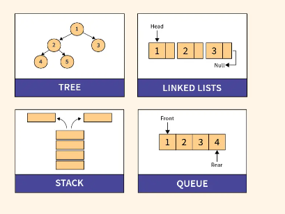
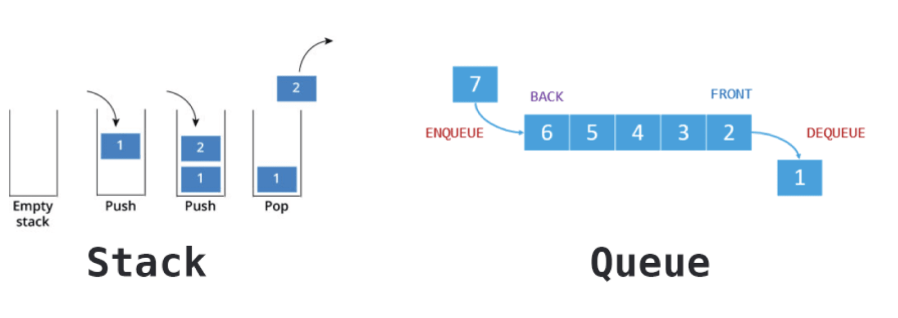
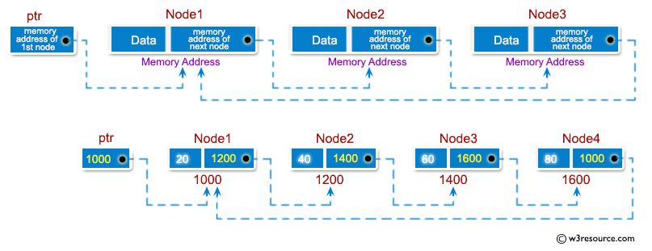
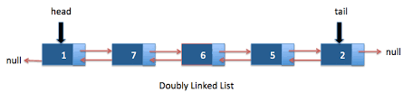

# Dynamic Data Structure

## Dynamic Data Structures VS Static Data Structures

|Static data structure|  Dynamic data structure |
|:-------------|:------| 
| size fixed | size can vary |
| cannot grow or shrink|can grow or shrink in size |
|  can only modify the data in the memory | can modify both the data items as well as the size of the structure |
|can only be done on the stack| can be done on both stack and heap|
|examples: array, matrix, struct, union| examples: tree, queue, stack, linked lists|


## What is Dynamic Data Structure

* The dynamic data structures are the ones that do not have a fixed size.
* A dynamic data structure can grow or shrink in size as required.
* Major disadvantage of dynamic data structures is that there is a possibility of underflow or overflow while performing allocation or deallocation of memory.
* Dynamic memory allocation can be done both on the stack and the heap.




## Stacks and Queues




### Stack 🍴

 A stack works like a stack of trays in a cafeteria. You always grab from the top, not the bottom. This means you will have a relationship where the most recent element will be the first serviced. Let’s go back to the example of 100 pieces of data coming in. In this case, 100 would be served first, then 99, then 98, then 97, and so on. This is helpful for something like an undo system on an application. Every step you make is inserted onto the stack. Then whenever you want to undo, you just “pop” off the top of the stack to go back in time.

#### Terminology
* Pop – to remove an element from a stack 

* Push – to insert an element onto a stack

* LIFO – means “last in, first out” (the technical term for a stack-like data structure)

### Queue 🎟️
 A queue is the more intuitive of the two. It works much like waiting in line to buy a ticket. The first element to get to the data structure is the first one to be served. So, say 100 pieces of data come in to a single processor. Number 1 will be served, then 2, then 3, and so on.

#### Terminology
* Enqueue – to insert an element onto a queue

* Dequeue – to remove an element from a queue

* FIFO – means “first in, first out” (the technical term for a queue-like data structure)

## Simply and Doubly Linked Lists

|Simply Linked Lists|  Doubly Linked Lists |
|:-------------|:------|
| 2 parts: data and next |3 parts: data, next and previous|
|raversal can be done using the next node link only (1 direction) |traversal can be done using the previous node link or the next node link (2 directions)| 
|occupies less memory space|occupies more memory space| 
|It requires only one list pointer variable (head)|It requires two list pointer variables (head and tail)| 
|It can be implemented on the stack|It can be implemented on stack, heap and binary tree.| 

### Singly Linked Lists (SLL)

A singly linked list can be simply called a linked list. A singly linked list is a list that consists of a collection of nodes, and each node has two parts; one part is the data part, and another part is the address. The singly linked can also be called a chain as each node refers to another node through its address part. 




#### Code 🤓
Node structure
```c
typedef struct node {
  int data;
  struct node *next;
} node;
```

Traverse (show list items)
```c
void traverse(node *l) {
    printf("\n\nList elements are - \n");
    while (l != NULL) {
        printf (" --> %d", l->data);
        l = l->next;
    }
    printf ("\n");
}
```
Insert
1. Insert **at the beginning**
* Allocate memory for new node
* Store data
* Change next of new node to point to head
* Change head to point to recently created node
  
```c
node *insert_lifo (node *l, int d){
    node *newNode;
    newNode = (node*) malloc(sizeof(struct node));
    newNode->data = d; // d == new data
    newNode->next = l; // l == head of node
    return newNode;
}
```
2. Insert **at the End**
* Allocate memory for new node
* Store data
* Traverse to last node
* Change next of last node to recently created node
```c
node *insert_fifo (node *l, int d)
    {
    node *newNode;
    newNode = (node*) malloc (sizeof (node));
    newNode->data = d;
    newNode->next = NULL;  //bc now it's the last node
    if (l == NULL){
        return newNode;
    }
    node *temp = l;
    while (temp->next != NULL){
        temp = temp->next;
    }
    // now temp is the last node
    temp->next = newNode;
    return l;
    }       
```

Free space ocupied by list
```c
node *destroy (node *l) {
    node * aux;
    while (l != NULL) { 
        aux = l; // aux == node 
        l = l->next; // l == next node
        free (aux); // frees node in aux
    }
    printf ("List was destroyed\n");
    return NULL;
}
```

### Doubly Linked Lists (DLL)

A doubly linked list is another type of the linked list. It is called a doubly linked list because it contains two addresses while a singly linked list contains a single address. It is a list that has total three parts, one is a data part, and others two are the pointers, i.e., previous and next. The previous pointer holds the address of the previous node, and the next pointer holds the address of the next node. Therefore, we can say that list has two references, i.e., forward and backward reference to traverse in either direction.




```c
```
```c
```
```c
```
## Trees 🌳🌳
A binary tree is a tree data structure in which each node can have at most two children, which are referred to as the left child and the right child. 

Each node in the tree contains the following:
* Data
* Pointer to the left child
* Pointer to the right child

