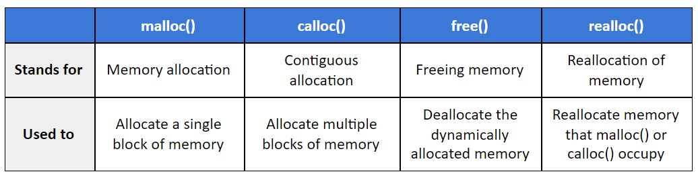

# Dynamic Memory
Many a time we face situations where data are dynamic in nature.
- Amount of data cannot be predicted
beforehand. 
- Number of data items keeps changing during program execution.

C language requires the number of elements
in an array to be specified at compile time, which often leads to wastage or memory space or program failure. Such situations can be handled more easily and effectively using **dynamic memory management techniques**:
- Memory space required can be specified at the time of execution. 
- C supports allocating and freeing memory dynamically using library routines.

## Memory in C


* **STATIC**: The program instructions and the global variables are stored in a region known as permanent storage area (they are permanent for the entire run of the program).
* **STACK**: local variables (automatic, continuous memory).
    * managed by the CPU, there is no ability to modify it
    * variables are allocated and freed automatically
    * it grows and shrinks as variables are created and destroyed
    * stack variables only exist whilst the function that created them exists 
* **HEAP**: dynamic storage (large pool of memory, not allocated in contiguous order). The size of the heap keeps changing.
    * managed by the programmer
    * variables are allocated and freed using functions like malloc() and free()
    * usually limited by the physical memory available
    * requires pointers to access it
  

<br>

## Memory Allocation Functions in stdlib



* malloc, calloc and realloc return a void pointer. If they return NULL it's because of insufficient memory space.

* sizes are in bytes

### Malloc
malloc allocates requested number of bytes and returns a pointer to the first byte of the allocated space. 
* A block of memory can be allocated using
the function malloc. It reserves a block of memory of specified size and returns a pointer of type void.
* The return pointer can be type casted to any pointer type.
* malloc always allocates a block of contiguous bytes. The allocation can fail if sufficient contiguous memory space is not available. If it fails, malloc returns NULL.
``` c
void *malloc(size_t tamaño_bloque);

ptr = (type *) malloc (byte_size);
ptr = (int*) malloc(sizeof(int));
```

### Calloc
calloc allocates space for an array of elements, initializes them to zero and then returns a pointer to the memory.
* The new memory block may or may not begin at the same place as the old one.
* If it does not find space, it will create it in an entirely different region and move the contents of the old block into the new block.
* The function guarantees that the old data remains intact.
* If it is unable to allocate, it returns NULL and frees the original block.
``` c
void *calloc(size_t cant_bloques, size_t tamaño_bloque);

ptr = malloc (size);           //original allocation
ptr = realloc (ptr, newsize); //reallocation
```

### Free
free function frees previously allocated space.
``` c
void free(void *puntero); 

free (ptr);
ptr = NULL;
```

### Realloc 
realloc modifies the size of previously allocated space.

``` c
void *realloc(void *puntero, size_t nuevo_tamaño_bloque);


```


``` c
```


``` c
```


``` c
```