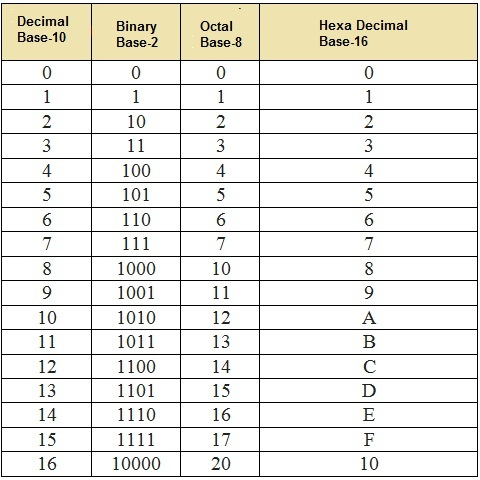
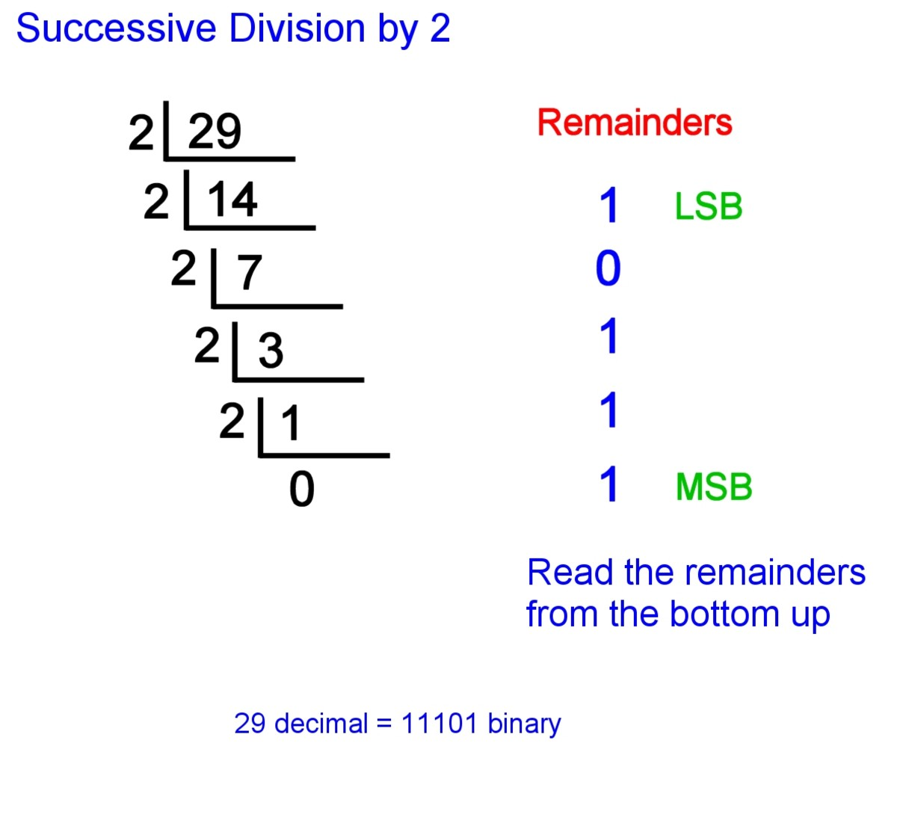
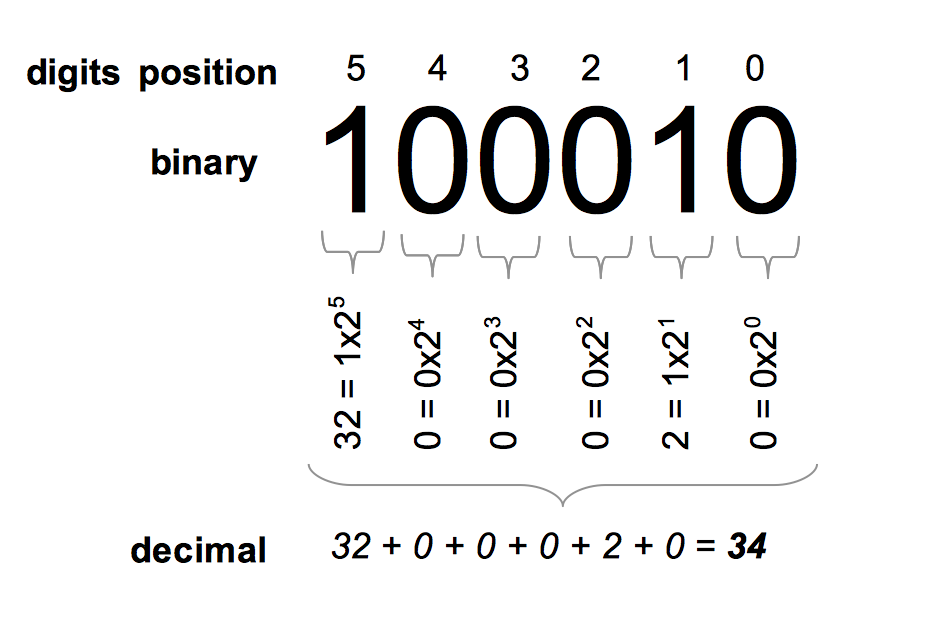
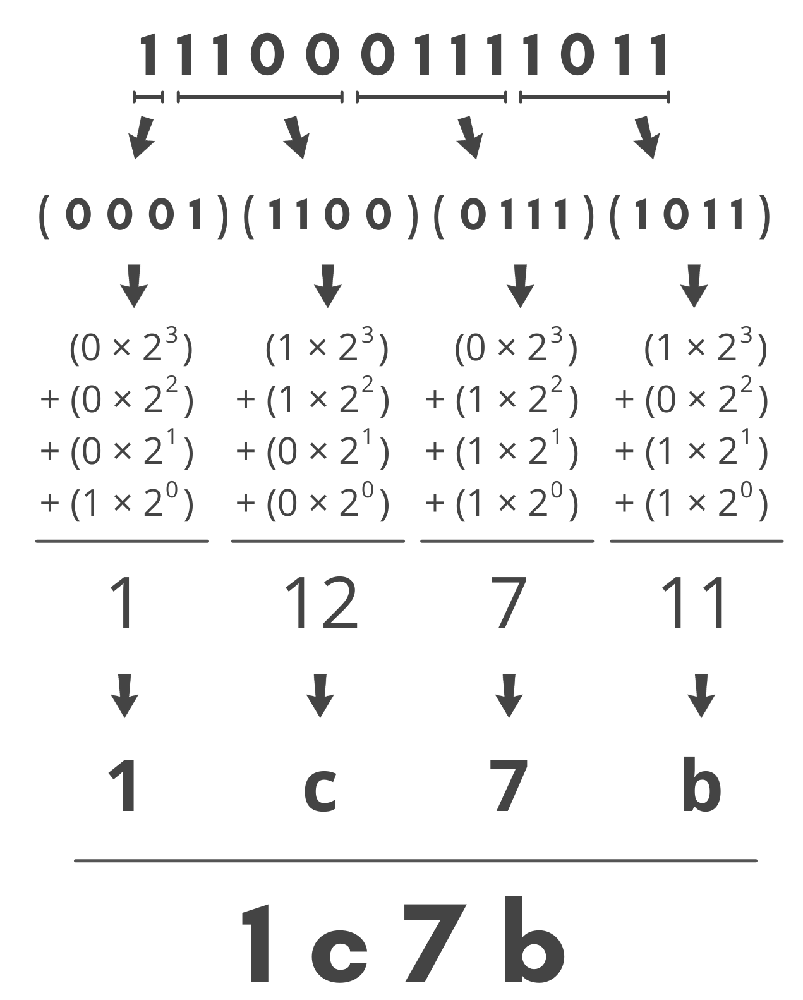
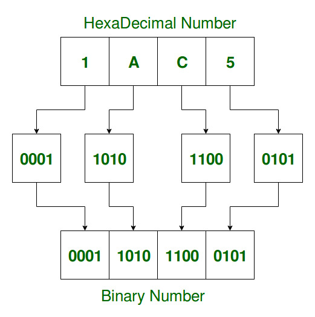
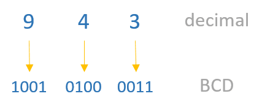
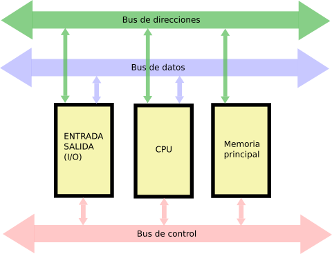
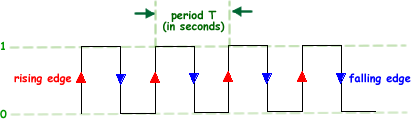

# Numeral system

A number system is defined as a system of writing to express numbers.
* The number of distinct symbols is called the base.
* A number with d digits in base b can represent b^d different combinations (values).
    * 2 decimal digits -> 10^2 = 100 possibilities (0-99)
    * 3 binary digits -> 2^3 = 8 possibilities (000-111)

There are various types of number systems in mathematics. The four most common number system types are:

* Base 10 (Decimal) — Represent any number using 10 digits [0–9]
* Base 2 (Binary) — Represent any number using 2 digits [0–1]
* Base 8 (Octal) — Represent any number using 8 digits [0–7]
* Base 16 (Hexadecimal) — Represent any number using 10 digits and 6 characters [0–9, A, B, C, D, E, F]

## Conversion

### Decimal to binary

### Binary to decimal

### Binary to hexadecimal

### Hexadecimal to binary

## Binary coded decimal (BCD)

The binary coded decimal (BCD) is a type of binary code used to represent a given decimal number in an equivalent binary form. Its main advantage is that it allows easy conversion to decimal digits for printing or display and faster calculations.

# Computer Architecture

## Hardware and software

* Hardware: Hardware refers to the physical components of a computer system or electronic device. It includes tangible, physical parts such as the processor, memory, storage devices, input devices (keyboard, mouse), output devices (monitor, printer), and other internal and external components. Hardware is responsible for the physical operations and functionality of a computer system.

* Software: Software refers to the non-tangible instructions or programs that are stored and executed on a computer system. It consists of computer programs, data, and instructions that tell the hardware how to perform specific tasks. Software can be categorized into two main types: system software and application software. System software includes the operating system, device drivers, and utility programs that manage and control the hardware resources. Application software includes programs designed to perform specific tasks or provide services to users, such as word processors, web browsers, and video games.

## Von Neumann Architecture
* A model proposed by John Von Neumann in 1945
* It features a single memory (RAM) that stores both data and executable code
* The processor communicates with the RAM and peripherals through a "bus."

One of the defining features of Von Neumann Architecture is the concept of a stored-program computer. In this architecture, both the program instructions and data are stored in the same memory unit. This means that the CPU can fetch instructions from memory, decode them, and execute them sequentially.

## Buses

* Data Bus: Transmits data between the different components of a computer system, such as the CPU, memory, and peripherals. It carries the actual data being transferred.

* Address Bus: Transmits memory addresses, specifying the location in the memory where data is read from or written to. It is used by the CPU to communicate with the memory and peripherals.

* Control Bus: Carries control signals that coordinate and regulate the operations of the computer system. It includes various control signals, such as:

    * Clock: Provides timing signals that synchronize the operations of the components. The clock signal determines the pace at which instructions are executed and data is processed.
    * Interrupt Request: Signals from peripherals to request attention from the CPU.
    * Memory Read/Write (R/W): Signals whether the current operation is a read or write operation.
    * Bus Request/Bus Grant: Signals used by devices to request or release control of the bus.
    * ACKs (Acknowledgment): Signals indicating the acknowledgment of a command or data transfer.

These bus types work together to enable communication and data transfer between the different components of a computer system. The data bus carries the actual data, the address bus specifies the memory locations, and the control bus manages the coordination and control signals necessary for proper system operation.

### Clock Signal (Clock):
A square wave signal that ensures synchronization among all components of a computer system. The clock signal is generated by an oscillator and provides a consistent timing reference for the operations of the system.

* Period (T): The period is the time it takes for one complete cycle of the clock signal to repeat. 
    
    * It is measured in units of time such as seconds [s], milliseconds [ms], microseconds [µs], nanoseconds [ns], and so on. 
    
    * The period determines the speed at which the system processes instructions and performs operations.

* Frequency (f): Frequency is the inverse of the period and represents the number of cycles of the clock signal that occur per unit of time. 
    
    * It is measured in Hertz [Hz], kilohertz [kHz], megahertz [MHz], gigahertz [GHz], and so on. 
    
    * The frequency indicates the speed at which the clock signal oscillates and determines the overall processing speed of the system.

The relationship between frequency and period is mathematically defined as follows: f = 1 / T

This means that the frequency is equal to the reciprocal of the period. As the period decreases, the frequency increases, and vice versa. The clock signal's frequency and period are crucial in determining the system's performance and the speed at which instructions are executed.

### CPU (Central Processing Unit):
The CPU, also known as the processor, is the primary component of a computer system responsible for executing instructions and performing calculations. It acts as the brain of the computer, coordinating and carrying out various operations.

**Registers:**

Registers are small storage areas within the CPU that hold data, instructions, and intermediate results during processing. They are the fastest and most accessible storage locations in the CPU. Registers are used to store operands, addresses, control information, and temporary data required for arithmetic and logical operations. They facilitate efficient data manipulation and reduce the need to access memory frequently.

**ALU (Arithmetic Logic Unit):**

The ALU is a component of the CPU that performs arithmetic operations (such as addition, subtraction, multiplication, and division) and logical operations (such as AND, OR, NOT) on data. It is responsible for carrying out mathematical calculations and logical comparisons. The ALU operates on data stored in registers, performs the requested operation, and stores the result back in registers for further processing or output.

**CU (Control Unit):**

The Control Unit is responsible for coordinating and controlling the operations of the CPU. It fetches instructions from memory, interprets them, and directs the necessary actions within the CPU to execute those instructions. The CU generates control signals that coordinate the flow of data and instructions between the CPU's different components, such as the ALU, registers, and memory. It ensures that instructions are executed in the proper sequence and manages the overall operation of the CPU. The control unit also handles tasks such as instruction decoding, branching, and managing interrupts.

In summary, the CPU consists of registers for temporary storage, the ALU for performing arithmetic and logical operations, and the CU for controlling and coordinating the execution of instructions. These components work together to process data, perform calculations, and carry out the instructions of a program.

**RAM (Random Access Memory)**

RAM (Random Access Memory) is a type of computer memory that provides fast and temporary storage for data and instructions used by the processor. It allows quick access and retrieval of information, contributing to overall system performance. RAM is volatile, meaning its contents are lost when power is turned off.

RAM serves as a temporary workspace for the processor, storing data and instructions that are actively being used. It provides fast and random access to data, allowing the processor to quickly retrieve and manipulate information.

The capacity of RAM determines how much data and how many programs can be stored and accessed simultaneously. RAM plays a crucial role in determining a computer's performance, as insufficient RAM can lead to slowdowns and limitations in multitasking capabilities.

### Processing Speed
Key factors in performance
* Word Size (16/32/64 bits, etc.)
* Clock Frequency [MHz / GHz]
* Number of Processors (CPUs)
* Number of Cores
* RAM Size
* RAM Speed (DDR2/DDR3/DDR4, etc.)
* Cache Size

## Others

### Interrupts
* Mechanism that allows the CPU to perform other tasks while waiting for I/O.
* There are priorities that allow for cascading interrupts.
* When an interrupt occurs, the state is saved on a stack, and a routine (function) is executed. Once it finishes, execution resumes from where it was interrupted.

### E/S (I/O) via ports in Linux
* Ports are a way to communicate with peripherals using "memory-like" addresses. It is done byte by byte through the use of Linux libraries.
* These addresses are connected to peripherals instead of RAM.
* Libraries: unistd.h, sys/io.h
* Functions: ioperm(), inb(), outb()