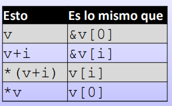
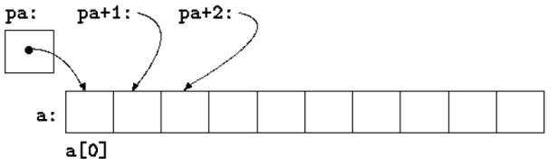
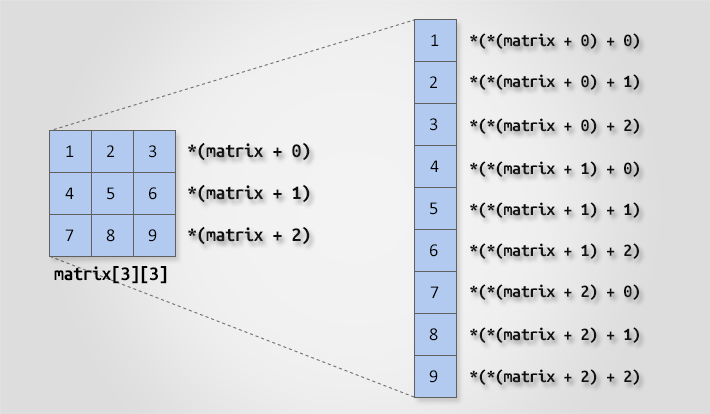

# Pointers

A pointer is a variable whose value is the address of another variable. 

### Declaration
Like any variable or constant, you must declare a pointer before using it to store any variable address. 
```c
int    *ip;    /* pointer to an integer */
double *dp;    /* pointer to a double */
float*  fp;    /* pointer to a float */
char*   ch     /* pointer to a character */
```

### Pointers and memory address

```c
int x = 21;     // An int variable
int* ptr = &x;  // A pointer variable that stores the address of x

printf("Value of x: %d\n", myAge); // x = 21

printf("Memory address of x: %p\n", &myAge); // &x = 0x7ffe5367e044

printf("Memory address of x with the pointer: %p\n", ptr); // ptr = 0x7ffe5367e044

printf("Value of x with the pointer: %p\n", *ptr); // *ptr = 21 --> this is called dereference
```

### Uses of *

Note that the * sign can be confusing here, as it does two different things in our code:
* When used in declaration (int* ptr), it creates a pointer variable.
* When not used in declaration, it act as a dereference operator - which means that it can output the value 

## Some pointers worth mentioning
### NULL pointer
If a pointer == NULL, that means that It has no memory address saved (so you can't use *p).

``` c
int *p;
p = NULL;
printf("%d", *p); // ERROR
```

### void pointer
The void pointer in C is a pointer that is not associated with any data types. It points to some data location in the storage.

! We cannot use it dereferenced (with *).

#### Syntax

``` c
void *name_of_pointer; //the void keyword acts as the pointer type
```

#### Casting
``` c
int x = 3;
void *ptr = &x;
printf("x == %d", * (int*) ptr);
```

## Arrays and Pointers

Arrays **are** ponters (an array name is a pointer to the first element).



 

```c
int a[10];
int *pa;

pa = &a[0];
```

### V[i] == *(v+i)

```c
char v[10];

v[0] = 15;
v[4] = 32;

printf("Memory address of first array element: %p \n", v); 
printf("Value of first array elemnt: %hhd \n", *v); // 15
printf("Value of array element number 4: %hhd \n", *(v+4)); // 32
```

### Increment and decrement pointers

```c
int main(){
    int a = 22;
    int *p = &a;
    printf("p = %u\n", p); // p = 6422288
    p++;
    printf("p++ = %u\n", p); //p++ = 6422292  // + 4 bytes
    p--;
    printf("p-- = %u\n", p); //p-- = 6422288  // - 4 bytes
 
    float b = 22.22;
    float *q = &b;
    printf("q = %u\n", q);  //q = 6422284
    q++;
    printf("q++ = %u\n", q); //q++ = 6422288      // + 4 bytes
    q--;
    printf("q-- = %u\n", q); //q-- = 6422284      // - 4 bytes
 
    char c = 'a';
    char *r = &c;
    printf("r = %u\n", r);   //r = 6422283
    r++;
    printf("r++ = %u\n", r);   //r++ = 6422284     // + 1 byte
    r--;
    printf("r-- = %u\n", r);   //r-- = 6422283     // - 1 byte
    return 0;
}
```
Example of usage:

```c
#include <stdio.h>
int main () {
	int i;
    int v[4] = {10, 20, 30, 40}; 
	int *p;
    
	p = v; /* It's the same as doing p = &v[0]; */
    
	for (i = 0; i < 4; i++) {
		printf ("Memory address: %p, value: %d \n", p, *p);
		p++;
	}
    
	return 0;
}
```

## Structs and pointers

### Declaration
```c
#include <stdio.h>
struct person{
   int age;
   float weight;
};

int main(){
    struct person *personPtr, person;
    personPtr = &person;
}
```

### Access through pointer
To access members of a structure using pointers, we use the -> operator. 

* **personPtr->age** is equivalent to (*personPtr).age
* **personPtr->weight** is equivalent to (*personPtr).weight
  
```c
    printf("Enter age: ");
    scanf("%d", &personPtr->age); // or &(*personPtr).age

    printf("Enter weight: ");
    scanf("%f", &personPtr->weight); // or &(*personPtr).weight

    printf("Displaying:\n");
    printf("Age: %d\n", personPtr->age);
    printf("weight: %f", personPtr->weight);
```

## Matrix and Pointers



``` c
matrix                  // Points to base address of two-dimensional array.

*(matrix)               // Points to first row of two-dimensional array.
*(matrix + 0)           // Points to first row of two-dimensional array.
*(matrix + 1)           // Points to second row of two-dimensional array.

**matrix                // Points to matrix[0][0]
*(*(matrix + 0))        // Points to matrix[0][0]
*(*(matrix + 0) + 0)    // Points to matrix[0][0]
*(*matrix + 1)          // Points to matrix[0][1]
*(*(matrix + 0) + 1)    // Points to matrix[0][1]
*(*(matrix + 2) + 2)    // Points to matrix[2][2]
```

## Pointer to pointer (**)

When we declare a variable in C with an asterisk (*), it means that the variable is a pointer, which is a special type of variable that stores the memory address of another variable.

For example, if we declare int* x;, this means that x is a pointer to an integer variable.

On the other hand, when we use two asterisks (**), it means that we have a pointer to a pointer. In other words, we have a variable that stores the memory address of another variable that is also a pointer.

For example, if we declare int** y;, this means that y is a pointer to a pointer to an integer variable.

🌟This is useful when you need to modify a pointer inside a function, because the original pointer is only modified if its memory address is passed to the function (i.e., a double pointer is used).