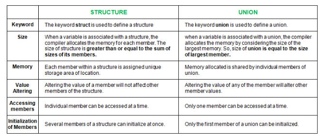

# Struct & Unions



## Struct
Structures (also called structs) are a way to group several related variables into one place. Each variable in the structure is known as a member of the structure.
</br></br>
Unlike an array, a structure can contain many different data types (int, float, char, etc.).

</br>

### How to use structs
<br>
BASICS

 1. Create struct outside main function

```c
struct student{
    int id;
    char name[10];
    float average;
};
```

 2. Declare a struct variable inside main

```c
int main()
{
    struct student s; // student struct
    struct student v[MAX]; //array of student structs
}
```

3. Access to struct

```c
    printf("Enter id: \n");
    scanf("%d", &s.id);


    printf("Enter name:\n");
    scanf("%s", s.name);
```


4. Array of structs

```c
int main{
    struct student v[4];


    for(int i=0; i<4; i++){

        printf("Enter id: \n");
        scanf("%d", &v[i].id);

        printf("Enter name: \n");
        scanf("%s", v[i].name);

        printf("Enter average: \n");
        scanf("%f", &v[i].average);
    }
}
```

```c
void mostrar(struct student v[]){
    for(int i=0; i<4; i++){
        printf("Id: %d - Name: %s - Average %.2f \n", v[i].id, v[i].name, v[i].average);
    }
}

```

FILE MANAGEMENT
1. Array of structs - knowing array length

* Writing file
```c
void grabar(struct estudiante v[], int i){
    int n;
    FILE* fp = fopen("estudiantes.dat", "wb");
    if(fp != NULL) {
        n = fwrite (v, sizeof(v[0]), i, fp); //sizeof(struct estudiante)
        if(n != i){
            printf("Error al grabar\n");
            fclose(fp);
            exit(4);
        }
        if( fclose(fp) != 0){
            printf("Error al cerrar\n");
            exit(5);
        }
    }
    else {
        printf("Error al abrir el archivo para escritura\n");
        exit(6);
    }
}
```

* Reading file

```c
void leerArchivo(struct estudiante v[], int i){
    int n;
    FILE *fp = fopen("estudiantes.dat", "rb");
    if(fp == NULL){
        perror("Error al abrir el archivo");
        exit(1);
    }
    n = fread(v, sizeof(v[0]), i, fp);

    if( fclose(fp) != 0){
        printf("Error al cerrar\n");
        exit(5);
    }
}
```


## Unions
A union is a special data type available in C that allows to store different data types in the same memory location. You can define a union with many members, but only one member can contain a value at any given time. Unions provide an efficient way of using the same memory location for multiple-purpose.

### Example
```c
union identidad {
    int dni; 
    long cuil; 
    char pasaporte[10]; 
};

struct persona {
    char apellido[20]; 
    char tipo_documento; /* 1=dni / 2=cuil / 3=pasaporte */
    union identidad nro_documento;
};
```

### How to use unions with structs
1. Enter data into struct with union

```c
    struct persona p1;

    printf("Ingrese tipo de identificacion (1=dni / 2=cuil / 3=pasaporte): ");
    scanf("%d", &p.tipo_documento);

    printf("Ingrese nro de identificacion: ");
    switch(p1.tipo_documento) {
        case 1:
            scanf("%d", &p1.nro_documento.dni);
            break;
        case 2:
            scanf("%ld", &p1.nro_documento.cuil);
            break;
        case 3:
            scanf("%s", p1.nro_documento.pasaporte);
            break;
        default:
            printf("Tipo invalido\n");
            break;
    }

```

2. Print
```c
void mostrar(struct persona p){
    switch(p.tipo_documento) {
        case 1:
            printf("Numero de DNI: %d\n", p.nro_documento.dni);
            break;
        case 2:
            printf("Numero de CUIL: %ld\n", p.nro_documento.cuil);
            break;
        case 3:
            printf("Numero de pasaporte: %s\n", p.nro_documento.pasaporte);
            break;
        default:
            printf("Tipo invalido\n");
            break;
    }
}
```


```c
```


```c
```
